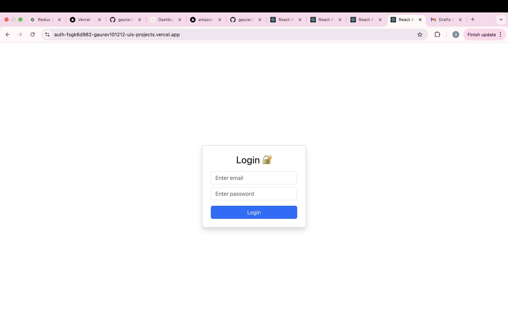
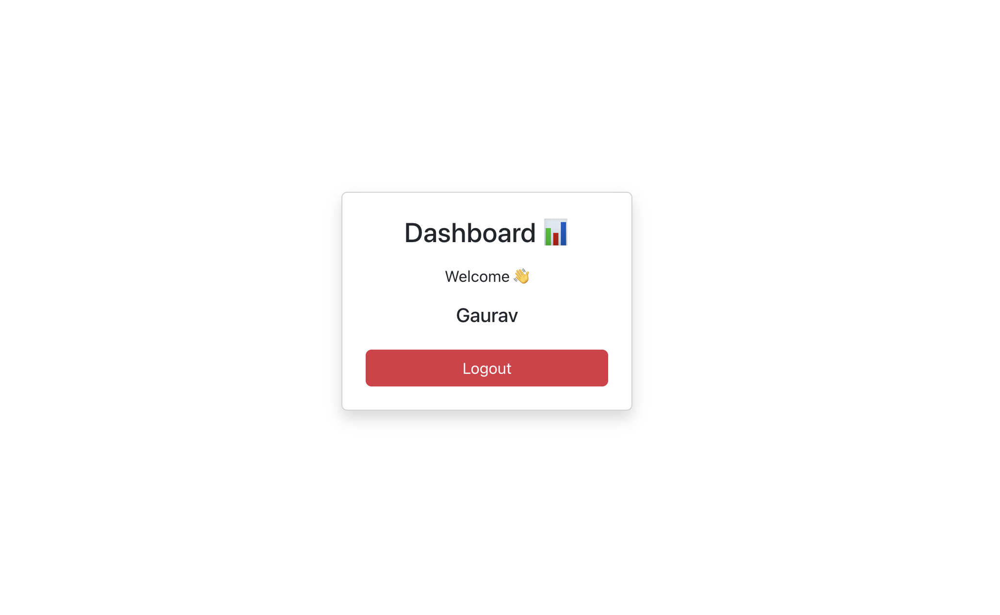

# 🔐 Auth System (React + Redux)

A simple authentication system built using React and Redux Toolkit. It includes login, logout, and protected routes functionality.

---

## 🚀 Live Demo

[https://YOUR-AUTH-LINK.vercel.app](https://auth-fsgk6d982-gaurav101212-uis-projects.vercel.app/)

---

## 📌 Features

* 🔐 Login functionality
* 🚪 Logout system
* 🧠 Global state management using Redux Toolkit
* 🔒 Protected routes (restricted access without login)
* 🔁 Redirect after login/logout
* ⚡ Fast and responsive UI

---

## 🛠️ Tech Stack

* React JS
* Redux Toolkit
* React Redux
* React Router DOM
* JavaScript (ES6+)
* CSS / Bootstrap

---

## 📦 Installation

```bash
npm install
npm start
```

---

## 🔁 How It Works

* User enters email & password
* Redux stores user data in global state
* If authenticated → access dashboard
* If not → redirect to login
* Logout clears user state

---

## 📸 Screenshots




---

## 📂 Project Structure

```text
src/
 ├── redux/
 │   ├── authSlice.js
 │   ├── store.js
 │
 ├── pages/
 │   ├── Login.js
 │   ├── Dashboard.js
 │
 ├── components/
 │   ├── ProtectedRoute.js
 │
 ├── App.js
 └── index.js
```

---


## 👨‍💻 Author

Gaurav Bhardwaj
